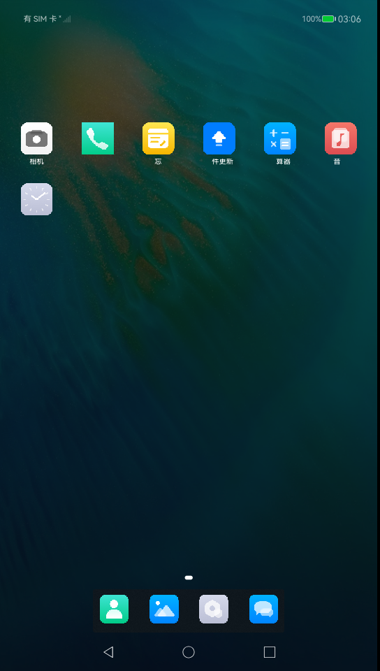
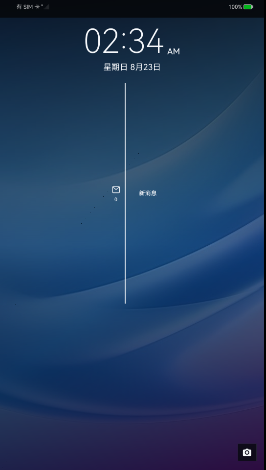

# OpenHarmony BB10 Shell

BlackBerry 10-inspired phone shell for OpenHarmony 6.0:

- launcher grid, dark overlay, compact spacing, and dock
- lock-screen clock, notification timeline, and camera shortcut
- dark SystemUI, status/navigation bars, shade, and control center
- dark square keyboard with suggestions and cyan accents

## Screenshots

| Launcher | Lock screen | Keyboard |
| --- | --- | --- |
|  |  |  |

## Source repositories

- [Launcher](https://github.com/dragan-novakovic/openharmony-applications-launcher/tree/bb10-ui)
- [ScreenLock](https://github.com/dragan-novakovic/openharmony-applications-screenlock/tree/bb10-ui)
- [SystemUI](https://github.com/dragan-novakovic/openharmony-applications-systemui/tree/bb10-ui)
- [Keyboard](https://github.com/dragan-novakovic/openharmony-bb10-keyboard)

## Install into a fresh OpenHarmony checkout

Initialize OpenHarmony 6.0.0.1 normally, then run:

```bash
git clone https://github.com/dragan-novakovic/openharmony-bb10.git
./openharmony-bb10/install.sh /path/to/OpenHarmony
```

The installer adds a local `repo` manifest for the three component forks,
copies the standalone keyboard source into `applications_app_samples`, and
downloads the signed keyboard HAP into `applications_hap`.

Keyboard HAP SHA-256:

```text
7f0b3a6ec202a0cc9f4bc752d42c252eaab0ba10c05123f6cca51accecba8dd3
```
